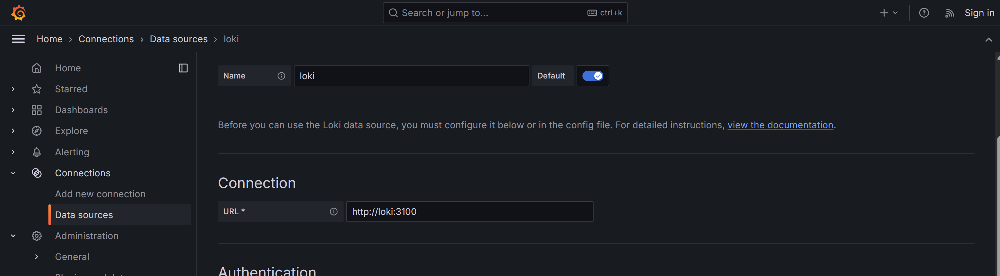
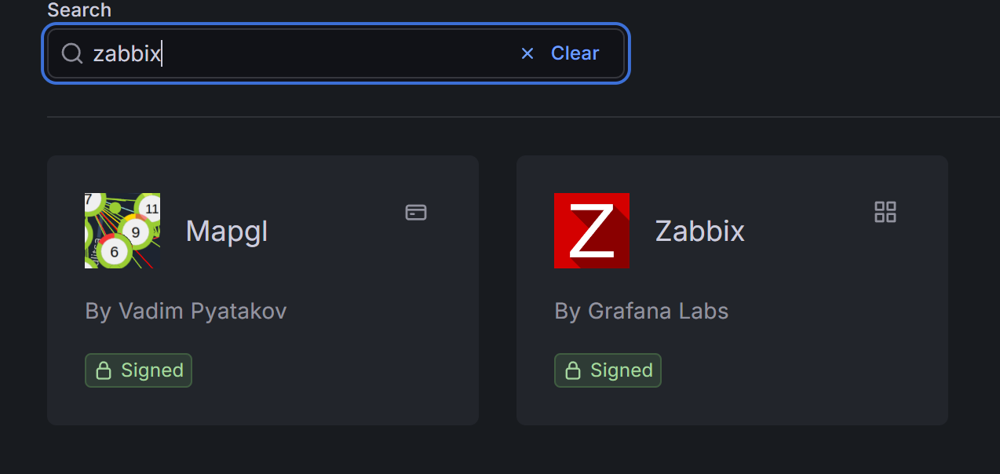

ИТМО Университет  
Факультет программной инженерии и компьютерной техники  
Дисциплина: Коммуникационные сервисы  

Лабораторная работа №2  
**Тема:** Логирование, мониторинг и визуализация на примере Nextcloud, Loki, Zabbix и Grafana  

Студенты:  
Группаы:  
Преподаватель: 

Санкт-Петербург, 2025 г.

---

## Цель работы

Изучить основы построения системы логирования, мониторинга и визуализации состояния сервиса на примере стека:
- Nextcloud как тестовое web‑приложение;
- Loki + Promtail для сбора и хранения логов;
- Zabbix для мониторинга доступности сервиса;
- Grafana для визуализации логов и метрик.

---

## Используемое ПО

- Docker, Docker Compose  
- Nextcloud (`nextcloud:29.0.6`)  
- Grafana Loki (`grafana/loki:2.9.0`)  
- Grafana (`grafana/grafana:11.2.0`)  
- Promtail (`grafana/promtail:2.9.0`)  
- PostgreSQL 15 (для Zabbix)  
- Zabbix Server + Zabbix Web (`zabbix/zabbix-server-pgsql:ubuntu-6.4-latest`, `zabbix/zabbix-web-nginx-pgsql:ubuntu-6.4-latest`)

---

## Ход работы

### Часть 1. Подготовка окружения и запуск docker-compose

1. Подключение по SSH к удалённой машине.

2. Передача файлов (в том числе `docker-compose.yml`) на удалённый сервер.

3. Запуск docker-compose для развёртывания стенда.

4. Проверка запущенных контейнеров.

5. Настройка брандмауэра / прокидывание нужных портов.

---

### Часть 2. Инициализация Nextcloud и проверка работы

1. Открытие мастера установки Nextcloud по адресу `http://<host>:8080` и задание параметров админ‑аккаунта.

2. Создание учётной записи администратора.

3. Открытие главной страницы Nextcloud, проверка работоспособности сервиса.

4. Дополнительные действия в интерфейсе (загрузка/удаление файлов и т.д.), формирующие логи.

---

### Часть 3. Логирование: Loki и Promtail

Для сбора логов Nextcloud был настроен агент Promtail, который читает лог‑файлы из тома с данными Nextcloud и отправляет их в Loki.  
Настройки описаны в файле `promtail_config.yml` (каталог `lab2_work`).

1. Проверка того, что Loki успешно принимает данные (статус сервиса / healthcheck).

2. Просмотр логов Nextcloud через интерфейс Grafana по источнику данных Loki.

---

### Часть 4. Мониторинг в Zabbix

Для мониторинга доступности Nextcloud был подготовлен шаблон Zabbix (`template.yml`), использующий HTTP‑агента для обращения к `status.php` приложения и определения режима обслуживания (maintenance).

1. Вход в веб‑интерфейс Zabbix.

2. Переход в раздел шаблонов и подготовка к импорту.

3. Импорт подготовленного шаблона мониторинга Nextcloud из файла `template.yml`.

4. Переход в раздел хостов и создание нового хоста для Nextcloud.

5. Заполнение параметров нового хоста и привязка к нему ранее импортированного шаблона.

6. Проверка, что хост успешно создан и активен.

7. Просмотр собираемых данных по хосту в разделе Latest data.

8. Наблюдение за метриками и состоянием Nextcloud по данным Zabbix.

9. Убедились, что триггеры по шаблону корректно срабатывают (например, при включении режима обслуживания).

---

### Часть 5. Визуализация в Grafana

1. Подключение к веб‑интерфейсу Grafana.

2. Настройка источника данных Loki и (при необходимости) источника Zabbix через установленный плагин.

3. Создание дашбордов для:
   - отображения логов Nextcloud (источник Loki);
   - отображения метрик доступности и состояния сервиса (источник Zabbix);
   - комбинированных панелей.

Примеры экранов с готовыми панелями приведены ниже.

---

## Ответы на контрольные вопросы

**1. Чем SLO отличается от SLA?**

- **SLA (Service Level Agreement)** – юридическое соглашение между поставщиком услуг и клиентом, определяющее условия предоставления услуги (например, минимальную доступность 99,9 %). При нарушении SLA возможны штрафы и другие санкции.  
- **SLO (Service Level Objective)** – внутренние целевые значения метрик для команды эксплуатации/разработки (например, целевая доступность 99,95 %). Это цель, но не обязательно формальное юридическое обязательство.

---

**2. Чем отличается инкрементальный бэкап от дифференциального?**

- **Дифференциальный бэкап** – копируются все данные, изменённые с момента последнего полного бэкапа. Для восстановления нужны последний полный бэкап и последний дифференциальный.  
- **Инкрементальный бэкап** – копируются данные, изменённые с момента любого последнего бэкапа (полного или инкрементального). Для восстановления нужны последний полный бэкап и вся цепочка инкрементальных бэкапов. Инкрементальные копии обычно меньше по размеру, но восстановление сложнее и дольше.

---

**3. В чём разница между мониторингом и observability?**

- **Мониторинг** – реактивный подход: наблюдение за заранее определёнными метриками и состояниями (CPU, RAM, ошибки, аптайм). Отвечает на вопрос «не вышло ли что‑то за порог?».  
- **Observability (наблюдаемость)** – проактивный подход: способность по логам, метрикам и трассировкам понять внутреннее состояние сложной системы и причину проблемы, даже если она заранее не была описана. Отвечает на вопрос «почему система ведёт себя именно так?».

---

## Вывод

В ходе лабораторной работы был развёрнут комплекс сервисов для логирования, мониторинга и визуализации состояния веб‑приложения Nextcloud с использованием Docker Compose.  
Promtail настроен на чтение лог‑файлов Nextcloud и отправку их в Loki, что позволило анализировать логи через Grafana.  
Система мониторинга Zabbix настроена для проверки состояния Nextcloud через HTTP‑запрос к `status.php` и реагирования на режим обслуживания с помощью триггера.  
В Grafana созданы дашборды, объединяющие логи и метрики, что обеспечивает наглядное представление о состоянии сервиса и позволяет оперативно выявлять и анализировать инциденты.

